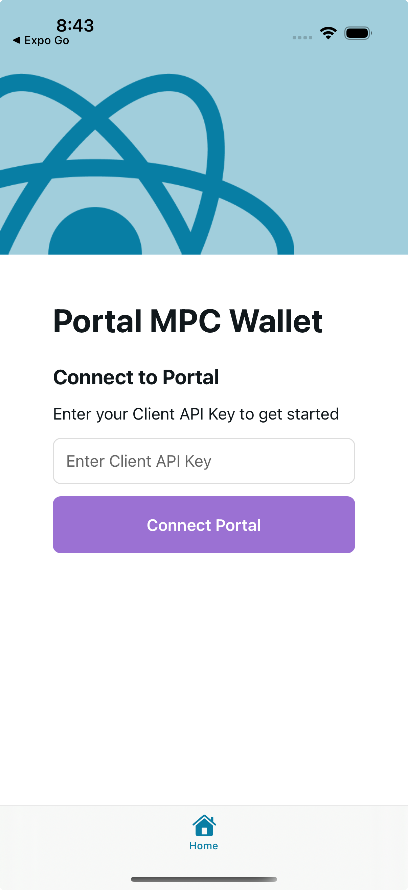
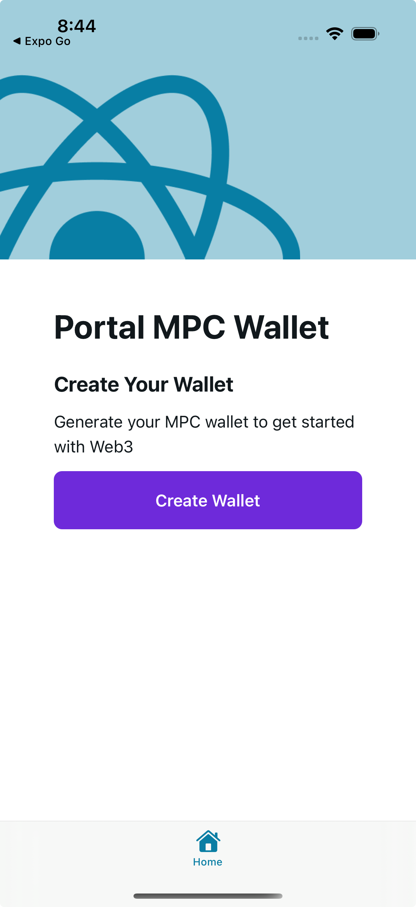
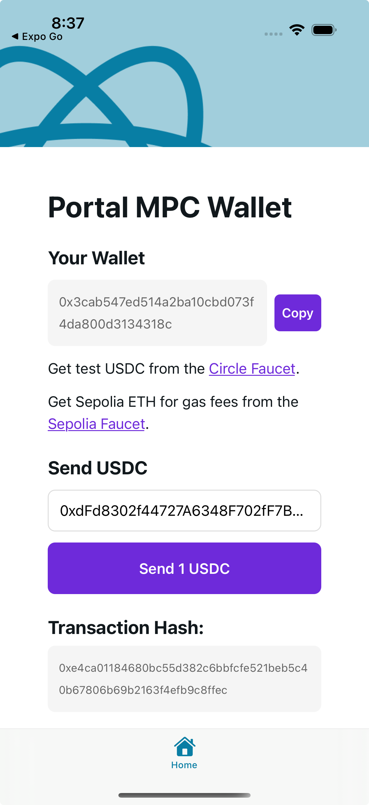

# Portal MPC Wallet Demo with Expo 👋

This is a project demonstrating how to integrate [Portal's React Native SDK](https://docs.portalhq.io) into an [Expo](https://expo.dev) application.

## Features

- Create a Portal client's wallet
- Back up the wallet
- Recover the wallet
- View the wallet's address
- Send USDC on Sepolia testnet

<div style="display: flex; justify-content: space-between; gap: 10px;">
  
  
  
</div>

## Setup

1. Install dependencies
   ```bash
   npm install
   ```

2. Configure Portal SDK
   - Reach out to Portal to get a [Client API Key](https://docs.portalhq.io/docs/getting-started/client-api-key), or if you already have access to the [Portal Admin Dashboard](https://app.portalhq.io), you can create a test Client API Key in Settings.
   - This app uses Sepolia testnet by default

3. Configure Alchemy API Key
   - Get an Alchemy API Key from [Alchemy](https://www.alchemy.com)
   - Update the `ALCHEMY_API_KEY` in the `config.ts` file

3. Build the app (we recommend using [Xcode](https://developer.apple.com/xcode/) or [Android Studio](https://developer.android.com/studio) and opening the Expo workspace directly)

4. Run the app on an iOS or Android simulator

## Important Notes

### Native Dependencies

This project includes Portal's MPC AAR file. To use it:

1. Install the development build
   ```bash
   npx expo install expo-dev-client
   ```

2. Create a development build
   ```bash
   npx expo prebuild
   ```

### Plugin Configuration

The project includes a custom Expo plugin (`./plugins/withPortalMPC.js`) that handles:
- Copying Portal's native MPC AAR file
- Setting up necessary Android/iOS configurations

## Development

You can start developing by editing the files inside the **app** directory. This project uses [file-based routing](https://docs.expo.dev/router/introduction).

### Testing the Wallet

1. Get test USDC from the [Circle Faucet](https://faucet.circle.com)
2. Get Sepolia ETH for gas from the [Sepolia Faucet](https://sepoliafaucet.com)

## Learn More

- [Portal Documentation](https://docs.portalhq.io)
- [Expo Documentation](https://docs.expo.dev)
